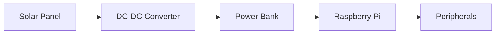

# HomeNexus Smart Hub - Hardware Assembly Guide

## 1. Bill of Materials
Verify you have all components before starting:

| Category        | Components |
|-----------------|------------|
| **Core**        | Raspberry Pi 5, 16GB microSD, USB-C PSU |
| **Power**       | Solar panel, 20,000mAh power bank, DC-DC converter |
| **Sensors**     | DS18B20, LDR, PIR, Reed switch, RFID reader |
| **Controls**    | 6x LEDs, Cooling fan, Heating pad, Servo |
| **Electronics** | MCP3008 ADC, TCA9548A I²C Mux, Resistors, Transistors |

## 2. Base Platform Construction
### Playmobil House Mounting
1. **Cut MDF base** to 30x25cm (adjust for your house size)
2. **Attach hinges** to back wall for easy access:
   ```python
   # Hinge placement diagram
   [House] ====||==== [Base]
            Hinge x2
   ```
3. **Create component zones**:
   - Left side: Power system
   - Center: Raspberry Pi
   - Right: Sensor array

## 3. Power System Assembly
### Solar Integration


1. **Wire solar panel** to converter's input (18-24V)
2. **Set converter output** to 5.1V (adjust trim pot)
3. **Connect power bank** to converter output
4. **Verify charging** with multimeter (5.0-5.2V)

## 4. Sensor Network Installation
### Temperature Sensor (DS18B20)
1. Enable 1-Wire interface:
   ```bash
   sudo raspi-config
   # Interface Options → 1-Wire → Enable
   ```
2. Wire configuration:
   ```
   DS18B20 Pinout:
   Red   → 3.3V
   Black → GND
   Yellow → GPIO4 (with 4.7kΩ pull-up)
   ```

### Light Sensor (LDR)
```
   LDR Circuit:
   3.3V —— LDR ——-||——- 10kΩ —— GND
               ADC Input (MCP3008 CH0)
```

## 5. Control Module Wiring
### LED Matrix
```python
# GPIO Mapping (BCM):
LEDS = [5, 6, 13, 19, 26, 21]  # Update in config.py
```
1. Use 220Ω current-limiting resistors
2. Common cathode configuration

### Servo Door Lock
```
SG90 Wiring:
Brown  → GND
Red    → 5V
Orange → GPIO12 (PWM)
```

## 6. Final Assembly Steps
1. **Secure all components** with hot glue
2. **Route cables** through cable channels
3. **Test each subsystem**:
   ```bash
   # Quick diagnostic
   python3 -c "from drivers.sensors import TemperatureSensor; print(TemperatureSensor().read())"
   ```

## 7. Safety Checks
- [ ] Verify no exposed conductors
- [ ] Confirm proper heat dissipation
- [ ] Test emergency shutdown (hold button for 3s)

Here's an enhanced wiring guide with detailed instructions for each critical component, including color-coded diagrams and verification steps:

---

### **Detailed Wiring Instructions**

#### **1. Power Distribution System**
```python
# Color Code:
# RED = 5V Power
# BLACK = Ground
# YELLOW = Data/Signal
```

**Solar → DC-DC Converter → Power Bank**
1. **Solar Panel Connections**:
   - Positive (red wire) → DC-DC Converter `Vin+`
   - Negative (black wire) → DC-DC Converter `Vin-`
   - *Verify*: 18-24V input with multimeter

2. **DC-DC Output to Power Bank**:
   - Set output to **5.1V** using the trim pot (adjust until multimeter reads 5.1V)
   - Connect converter `Vout+` → Power Bank input `+`
   - Connect converter `Vout-` → Power Bank input `-`

3. **Raspberry Pi Power**:
   - Power Bank USB-C → Pi's USB-C port
   - *Verify*: `vcgencmd measure_voltage` shows stable ~5V

---

#### **2. Temperature Sensor (DS18B20)**
```python
# Required: 4.7kΩ resistor (pull-up)
# GPIO4 (Pin 7 on Pi)
```
```
DS18B20 Wiring:
   RED (VDD) ─── 3.3V (Pin 1)
   YELLOW (DQ) ── GPIO4 (Pin 7) ──── 4.7kΩ ─── 3.3V
   BLACK (GND) ── GND (Pin 9)
```
**Verification**:
```bash
ls /sys/bus/w1/devices/  # Should show "28-xxxx" entry
cat /sys/bus/w1/devices/28-*/w1_slave  # Read temp
```

---

#### **3. Light Sensor (LDR + MCP3008)**
```python
# MCP3008 Connections (SPI):
# CLK  → SCLK (Pin 23)
# CS   → CE0 (Pin 24)
# MISO → MISO (Pin 21)
# MOSI → MOSI (Pin 19)
```
```
LDR Circuit:
   3.3V ─── LDR ──── MCP3008 CH0
               │
             10kΩ
               │
              GND
```
**Calibration**:
```python
# In drivers/sensors.py adjust:
LUX_SCALE = 1000  # Max expected lux value
```

---

#### **4. RFID Reader (MFRC522)**
```python
# Pinout:
# SDA  → GPIO25 (Pin 22)
# SCK  → GPIO11 (Pin 23)
# MOSI → GPIO10 (Pin 19)
# MISO → GPIO9 (Pin 21)
# GND  → GND (Pin 20)
# RST  → GPIO8 (Pin 24)
# 3.3V → 3.3V (Pin 17)
```
**Test Command**:
```python
from drivers.lcd_rfid import RFIDReader
rfid = RFIDReader(rst_pin=25)
print(rfid.read_tag())  # Scan a tag
```

---

#### **5. INA219 Power Monitors (via TCA9548A)**
```python
# I²C Multiplexer Setup:
# VCC → 3.3V
# GND → GND
# SDA → GPIO2 (Pin 3)
# SCL → GPIO3 (Pin 5)
```
```
INA219 Connections (per sensor):
   Vin+  → Solar/Power Bank +
   Vin-  → Load +
   GND   → Common ground
```
**Address Assignment**:
```python
# Each INA219 needs unique address (0x40-0x45):
# Bridge A0/A1/GND pins per datasheet
```

---

#### **6. LED Matrix with PWM**
```python
# GPIO Mapping (BCM):
LED_PINS = [5, 6, 13, 19, 26, 21]  # Update in config.py
```
```
LED Wiring (per channel):
   GPIO Pin ─── 220Ω Resistor ─── LED+ 
   LED- ─── GND
```
**Test Script**:
```python
import RPi.GPIO as GPIO
for pin in LED_PINS:
    GPIO.setup(pin, GPIO.OUT)
    GPIO.output(pin, GPIO.HIGH)
    time.sleep(0.5)
    GPIO.output(pin, GPIO.LOW)
```

---

#### **7. Servo Door Lock (SG90)**
```python
# PWM Settings:
# Frequency: 50Hz
# Duty Cycle: 2.5% (0°) to 12.5% (180°)
```
```
Servo Connections:
   BROWN  → GND (Pin 14)
   RED    → 5V (Pin 2)
   ORANGE → GPIO12 (Pin 32, PWM0)
```
**Calibration**:
```python
servo_pwm.ChangeDutyCycle(7.5)  # 90° position
time.sleep(1)
servo_pwm.ChangeDutyCycle(0)    # Disable
```

---

### **Verification Checklist**
1. **Power Systems**:
   ```bash
   vcgencmd measure_volts  # Should show ~5V
   i2cdetect -y 1         # Verify I²C devices
   ```

2. **Sensor Tests**:
   ```bash
   python3 -c "from drivers.sensors import TemperatureSensor; print(f'{TemperatureSensor().read()}°C')"
   ```

3. **Load Tests**:
   - Simultaneously activate all LEDs + fan
   - Monitor voltage drop (should stay >4.8V)

---

### **Pro Tips**
- **Cable Management**: Use braided sleeve for wire bundles
- **Heat Shrink**: Insulate all solder joints
- **Labeling**: Tag GPIO lines with masking tape flags

## Troubleshooting
| Symptom | Solution |
|---------|----------|
| No power | Check DC-DC converter output |
| Sensor failures | Verify I²C addresses with `i2cdetect -y 1` |
| RF interference | Add ferrite beads to power lines |

> **Pro Tip**: Use color-coded Dupont cables (Red=5V, Black=GND, Yellow=Signal)

---

---

### **1. Power Distribution System**
```python
# Color Code:
# RED = 5V Power
# BLACK = Ground
# YELLOW = Data/Signal
```

**Solar → DC-DC Converter → Power Bank**
1. **Solar Panel Connections**:
   - Positive (red wire) → DC-DC Converter `Vin+`
   - Negative (black wire) → DC-DC Converter `Vin-`
   - *Verify*: 18-24V input with multimeter

2. **DC-DC Output to Power Bank**:
   - Set output to **5.1V** using the trim pot (adjust until multimeter reads 5.1V)
   - Connect converter `Vout+` → Power Bank input `+`
   - Connect converter `Vout-` → Power Bank input `-`

3. **Raspberry Pi Power**:
   - Power Bank USB-C → Pi's USB-C port
   - *Verify*: `vcgencmd measure_voltage` shows stable ~5V

---

### **2. Temperature Sensor (DS18B20)**
```python
# Required: 4.7kΩ resistor (pull-up)
# GPIO4 (Pin 7 on Pi)
```
```
DS18B20 Wiring:
   RED (VDD) ─── 3.3V (Pin 1)
   YELLOW (DQ) ── GPIO4 (Pin 7) ──── 4.7kΩ ─── 3.3V
   BLACK (GND) ── GND (Pin 9)
```
**Verification**:
```bash
ls /sys/bus/w1/devices/  # Should show "28-xxxx" entry
cat /sys/bus/w1/devices/28-*/w1_slave  # Read temp
```

---

### **3. Light Sensor (LDR + MCP3008)**
```python
# MCP3008 Connections (SPI):
# CLK  → SCLK (Pin 23)
# CS   → CE0 (Pin 24)
# MISO → MISO (Pin 21)
# MOSI → MOSI (Pin 19)
```
```
LDR Circuit:
   3.3V ─── LDR ──── MCP3008 CH0
               │
             10kΩ
               │
              GND
```
**Calibration**:
```python
# In drivers/sensors.py adjust:
LUX_SCALE = 1000  # Max expected lux value
```

---

### **4. RFID Reader (MFRC522)**
```python
# Pinout:
# SDA  → GPIO25 (Pin 22)
# SCK  → GPIO11 (Pin 23)
# MOSI → GPIO10 (Pin 19)
# MISO → GPIO9 (Pin 21)
# GND  → GND (Pin 20)
# RST  → GPIO8 (Pin 24)
# 3.3V → 3.3V (Pin 17)
```
**Test Command**:
```python
from drivers.lcd_rfid import RFIDReader
rfid = RFIDReader(rst_pin=25)
print(rfid.read_tag())  # Scan a tag
```

---

### **5. INA219 Power Monitors (via TCA9548A)**
```python
# I²C Multiplexer Setup:
# VCC → 3.3V
# GND → GND
# SDA → GPIO2 (Pin 3)
# SCL → GPIO3 (Pin 5)
```
```
INA219 Connections (per sensor):
   Vin+  → Solar/Power Bank +
   Vin-  → Load +
   GND   → Common ground
```
**Address Assignment**:
```python
# Each INA219 needs unique address (0x40-0x45):
# Bridge A0/A1/GND pins per datasheet
```

---

### **6. LED Matrix with PWM**
```python
# GPIO Mapping (BCM):
LED_PINS = [5, 6, 13, 19, 26, 21]  # Update in config.py
```
```
LED Wiring (per channel):
   GPIO Pin ─── 220Ω Resistor ─── LED+ 
   LED- ─── GND
```
**Test Script**:
```python
import RPi.GPIO as GPIO
for pin in LED_PINS:
    GPIO.setup(pin, GPIO.OUT)
    GPIO.output(pin, GPIO.HIGH)
    time.sleep(0.5)
    GPIO.output(pin, GPIO.LOW)
```

---

### **7. Servo Door Lock (SG90)**
```python
# PWM Settings:
# Frequency: 50Hz
# Duty Cycle: 2.5% (0°) to 12.5% (180°)
```
```
Servo Connections:
   BROWN  → GND (Pin 14)
   RED    → 5V (Pin 2)
   ORANGE → GPIO12 (Pin 32, PWM0)
```
**Calibration**:
```python
servo_pwm.ChangeDutyCycle(7.5)  # 90° position
time.sleep(1)
servo_pwm.ChangeDutyCycle(0)    # Disable
```

---

### **Verification Checklist**
1. **Power Systems**:
   ```bash
   vcgencmd measure_volts  # Should show ~5V
   i2cdetect -y 1         # Verify I²C devices
   ```

2. **Sensor Tests**:
   ```bash
   python3 -c "from drivers.sensors import TemperatureSensor; print(f'{TemperatureSensor().read()}°C')"
   ```

3. **Load Tests**:
   - Simultaneously activate all LEDs + fan
   - Monitor voltage drop (should stay >4.8V)

---

#### **Pro Tips**
- **Cable Management**: Use braided sleeve for wire bundles
- **Heat Shrink**: Insulate all solder joints
- **Labeling**: Tag GPIO lines with masking tape flags
