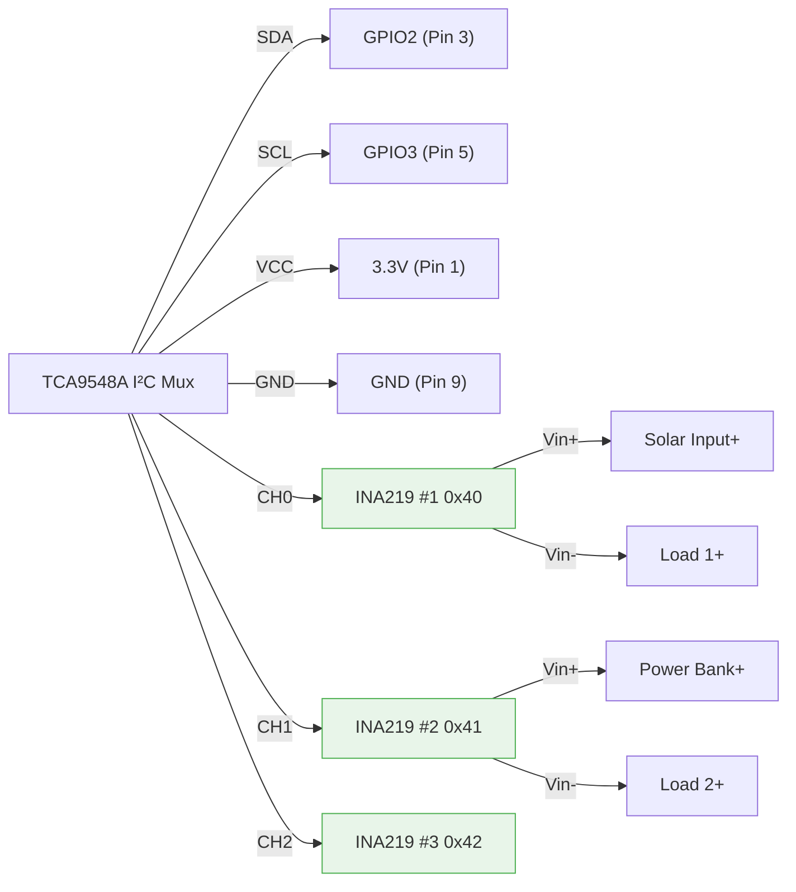

```mermaid
graph LR
    MUX["TCA9548A I²C Mux"] -->|SDA| RPI3["GPIO2 (Pin 3)"]
    MUX -->|SCL| RPI5["GPIO3 (Pin 5)"]
    MUX -->|VCC| RPI1["3.3V (Pin 1)"]
    MUX -->|GND| RPI9["GND (Pin 9)"]
    
    MUX -->|CH0| INA1["INA219 #1 0x40"]
    MUX -->|CH1| INA2["INA219 #2 0x41"]
    MUX -->|CH2| INA3["INA219 #3 0x42"]
    
    INA1 -->|Vin+| PS1["Solar Input+"]
    INA1 -->|Vin-| LOAD1["Load 1+"]
    INA2 -->|Vin+| PS2["Power Bank+"]
    INA2 -->|Vin-| LOAD2["Load 2+"]
    
    classDef ina fill:#e8f5e9,stroke:#4caf50;
    class INA1,INA2,INA3 ina;
```
