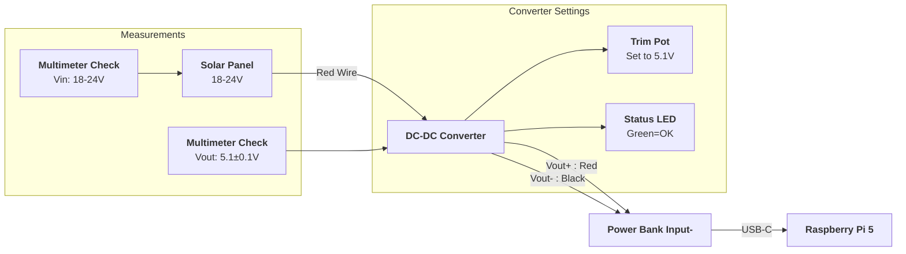

```mermaid
graph LR
    SOLAR[<b>Solar Panel</b><br>18-24V] -->|Red Wire| DC[<b>DC-DC Converter</b>]
    DC -->|Vout+ : Red| PB[<b>Power Bank Input+</b>]
    DC -->|Vout- : Black| PB[<b>Power Bank Input-</b>]
    PB -->|USB-C| RPI[<b>Raspberry Pi 5</b>]
    
    subgraph Converter Settings
        DC --> TRIM[<b>Trim Pot</b><br>Set to 5.1V]
        DC --> LED[<b>Status LED</b><br>Green=OK]
    end
    
    subgraph Measurements
        MM1[<b>Multimeter Check</b><br>Vin: 18-24V] --> SOLAR
        MM2[<b>Multimeter Check</b><br>Vout: 5.1±0.1V] --> DC
    end
```
