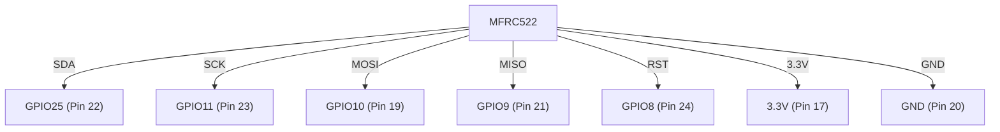

```mermaid
graph TB
    RFID["MFRC522"] -->|SDA| RPI22["GPIO25 (Pin 22)"]
    RFID -->|SCK| RPI23["GPIO11 (Pin 23)"]
    RFID -->|MOSI| RPI19["GPIO10 (Pin 19)"]
    RFID -->|MISO| RPI21["GPIO9 (Pin 21)"]
    RFID -->|RST| RPI24["GPIO8 (Pin 24)"]
    RFID -->|3.3V| RPI17["3.3V (Pin 17)"]
    RFID -->|GND| RPI20["GND (Pin 20)"]
    

```
