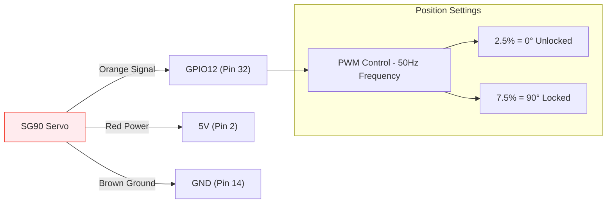

```mermaid
graph LR
    SERVO["SG90 Servo"] -->|Orange Signal| RPI32["GPIO12 (Pin 32)"]
    SERVO -->|Red Power| RPI2["5V (Pin 2)"]
    SERVO -->|Brown Ground| RPI14["GND (Pin 14)"]
    
    RPI32 --> PWM["PWM Control - 50Hz Frequency"]
    
    subgraph Position_Settings["Position Settings"]
        PWM --> OPEN["2.5% = 0° Unlocked"]
        PWM --> CLOSE["7.5% = 90° Locked"]
    end
    
    classDef servo fill:#ffebee,stroke:#f44336;
    class SERVO servo;
```
