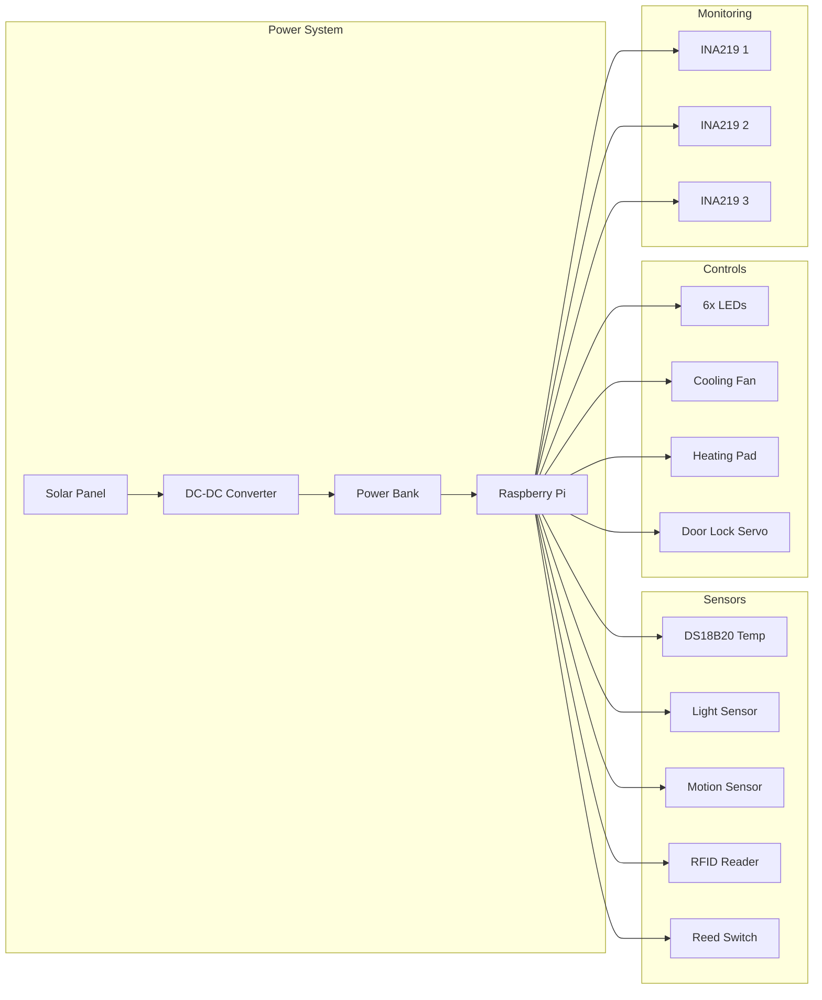

```mermaid
graph LR
    subgraph Power System
        SOLAR[Solar Panel] --> DC[DC-DC Converter]
        DC --> PB[Power Bank]
        PB --> RPI[Raspberry Pi]
    end
    
    subgraph Sensors
        RPI --> TEMP[DS18B20 Temp]
        RPI --> LDR[Light Sensor]
        RPI --> PIR[Motion Sensor]
        RPI --> RFID[RFID Reader]
        RPI --> DOOR[Reed Switch]
    end
    
    subgraph Controls
        RPI --> LEDS[6x LEDs]
        RPI --> FAN[Cooling Fan]
        RPI --> HEAT[Heating Pad]
        RPI --> SERVO[Door Lock Servo]
    end
    
    subgraph Monitoring
        RPI --> INA1[INA219 1]
        RPI --> INA2[INA219 2]
        RPI --> INA3[INA219 3]
    end
```
