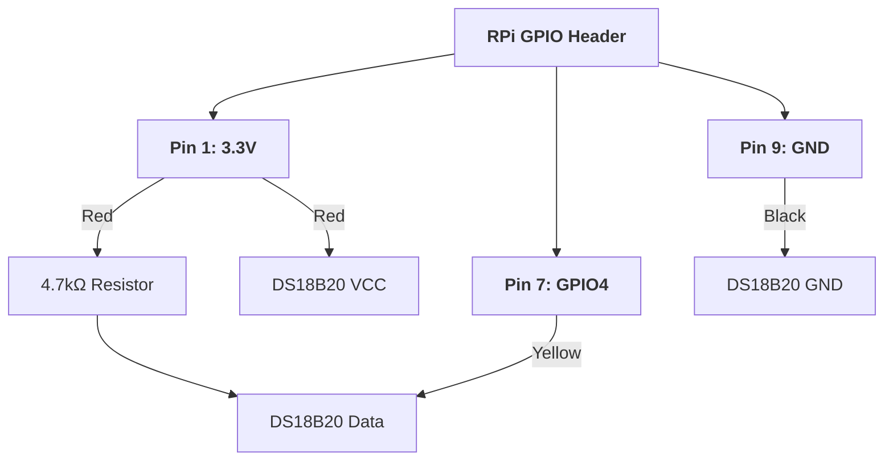

```mermaid
graph TB
    RPI[<b>RPi GPIO Header</b>] --> PIN1[<b>Pin 1: 3.3V</b>]
    RPI --> PIN7[<b>Pin 7: GPIO4</b>]
    RPI --> PIN9[<b>Pin 9: GND</b>]
    
    PIN1 -->|Red| RES[4.7kΩ Resistor]
    PIN7 -->|Yellow| DATA[DS18B20 Data]
    PIN9 -->|Black| GND[DS18B20 GND]
    
    RES --> DATA
    PIN1 -->|Red| VCC[DS18B20 VCC]
    
    classDef red fill:#ffcccc,stroke:#f66;
    classDef yellow fill:#ffffcc,stroke:#cc0;
    classDef black fill:#666,stroke:#000,color:#fff;
    class PIN1,PIN7,PIN9,VCC,DATA,GND,RES red,yellow,black;
```
