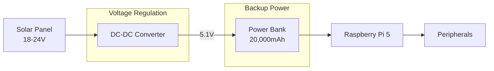
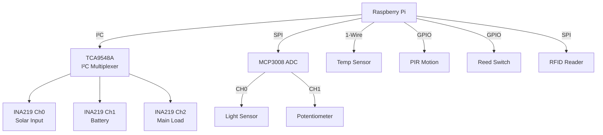
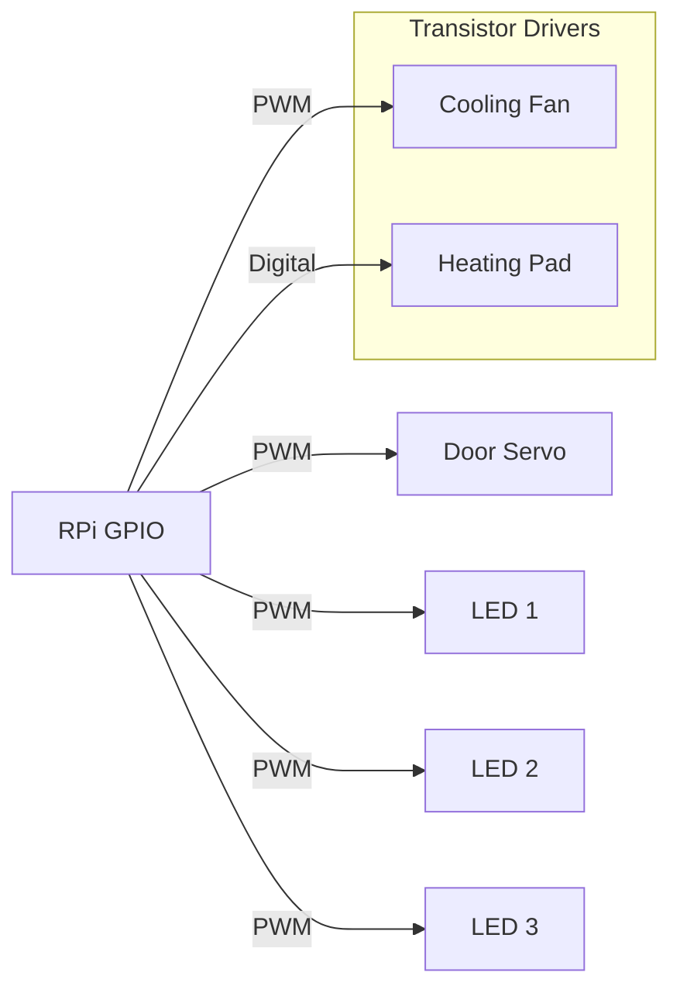

# HomeNexus Smart Hub - Main System Schematic

## Power Distribution System


## Sensor Network Architecture


## Control System Wiring


## Detailed Component Schematics

### INA219 Power Monitor Circuit
```
     Solar/Battery + ───────────────╮
                                    │
     ╭───────────────┬───────────────┤
     │               │               │
     │            ┌──┴──┐        ┌───┴──┐
     │            │     │        │      │
     ├────────────┤ IN+ ├────────┤ Vin+ │
     │            │     │        │      │
     │            └──┬──┘        └──┬───┘
     │               │              │   INA219
     │            ┌──┴──┐        ┌──┴───┐
     │            │     │        │      │
     ├────────────┤ IN- ├────────┤ Vin- │
     │            │     │        │      │
     │            └─────┘        └──┬───┘
     │               │              │
     ╰───────────────┴──────────────┤
                                    │
     Load + ────────────────────────╯
```

### LED Control Circuit
```
GPIO (3.3V) ─── 220Ω ───┬── LED+ 
                        │
                        ├── 1N5819 Diode (reverse protection)
                        │
GND ────────────────────┴── LED-
```

### Fan Control Circuit
```
GPIO (PWM) ─── 100Ω ───┬── Base (SS8050)
                       │
5V ────────────────────┼── Collector
                       │
GND ───────────────────┴── Emitter ─── Fan- 
                       │
                       └── Fan+ ───── 5V
```

### Temperature Sensor Wiring
```
3.3V ───────────────╮
                    │
                    ├── 4.7kΩ ─── GPIO4
                    │
DS18B20 Data ───────╯
                    │
DS18B20 GND ─────── GND
```

## Verification Points
| Test Point | Expected Value | Measurement Tip |
|------------|----------------|-----------------|
| DC-DC Output | 5.1V ±0.1V | Measure at power bank input |
| GPIO High | 3.3V | No load condition |
| I²C SDA/SCL | Pulsed 3.3V | Use oscilloscope |
| Servo Signal | 50Hz PWM | Duty cycle 2.5-12.5% |

> **Safety Notice**: Always disconnect solar input before making wiring changes. Use 20AWG wire for all power connections.
